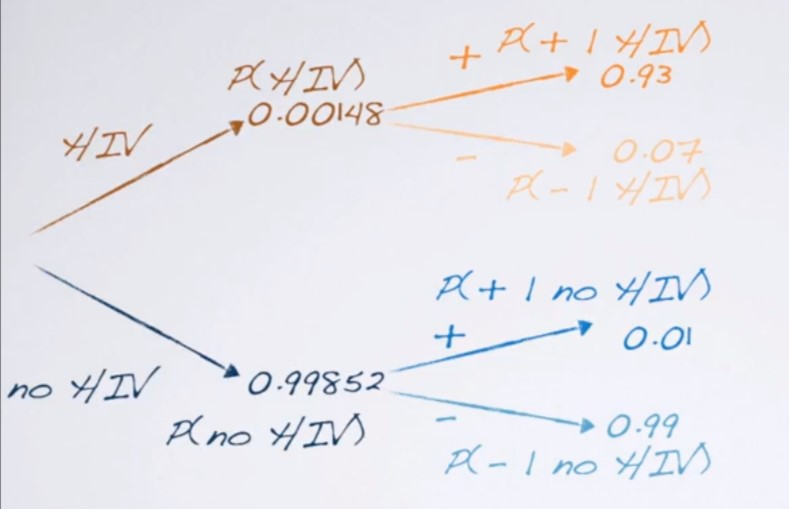
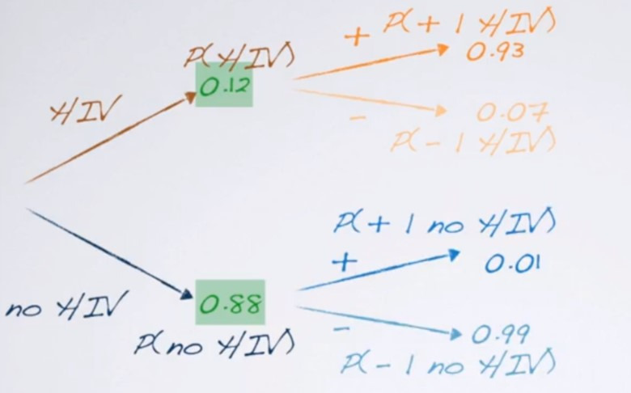

```{r setup, include=FALSE}
knitr::opts_chunk$set(echo = TRUE)
```


# Week 1

In this week, we have discussed how to use conditional probability and Bayes' Rule to derive posterior probability of an event or a hypothesis. We also illustrated the difference between frequentist approach and Bayesian approach on inference using several examples.

## Bayes's Rule and Bayes Updating

The Bayes' Rule is a simple application of conditional probability. For two events $A$ and $B$, the probability of their intersection $A\text{ and }B$ can be calculated in two ways:

$$ P(A\text{ and }B) = P(A~|~B)\times P(B) = P(B~|~A)\times P(A). $$

We can use this to calculate the conditional probability $P(A~|~B)$ by dividing $P(B)$ on both sides, and get
\begin{equation}
P(A~|~B) = \frac{P(B~|~A)\times P(A)}{P(B)}.
\label{eq:Bayes1}
\end{equation}

However, most of the time it is not easy to get $P(B)$ directly. Using Law of Total Probability, we can break $P(B)$ down into (at least) two pieces. One piece that relates to the probability conditioning on $A$, and another piece that relates to the probability conditioning on the complementary event $A^c$.^[The number of pieces depends on how the sample space is partitioned. Here we only partition the sample space into $A$ and $A^c$.]

With this, we can further break down the Bayes' Rule formula (\ref{eq:Bayes1}) into
$$ P(A~|~B) = \frac{P(B~|~A)\times P(A)}{P(B~|~A)\times P(A) + P(B~|~A^c)\times P(A^c)}. $$

This will be the one that we use most of the time in this course. Applying this to data and hypothesis, we can rewrite it into 
$$ P(\text{hypothesis}~|~\text{data}) = \frac{P(\text{data}~|~\text{hypothesis})P(\text{hypothesis})}{P(\text{data}~|~\text{hypothesis})P(\text{hypothesis}) + P(\text{data}~|~\text{complement hypothesis})P(\text{complement hypothesis})}. $$

Using the language of prior, likelihood, and posterior, we say that
\begin{align*}
& P(\text{hypothesis})\text{ or }P(A) &  & \text{ prior probability}\\
& P(\text{data}~|~\text{hypothesis})\text{ or }P(B~|~A) &  & \text{ likelihood of the data}\\
& P(\text{hypothesis}~|~\text{data})\text{ or }P(A~|~B) &  & \text{ posterior probability}.
\end{align*}


### Example 1

Let us review the HIV diagnostic testing example and dive deeper to understand how Bayes' Rule and Bayes updating work. 

> In the 80's, the US military used the ELISA (enzyme-linked immunosorbent assay) and the Western blot test to test whether recruits had HIV (human immunodeficiency virus). The sensitivity (true positive) of the ELISA test is about 93%, and the specificity (true negative) of the ELISA test is around 99%. It was estimated that 1.48/1000 adult Americans were HIV positive. Given that a recruit had received 2 ELISA tests and got 2 positive results, what would be the probability that this recruit had HIV?

Before solving the problem, let us "translate" the information into probability notations, so that it is easier for us to see what information we were given.

The question asked for the probability the recruit had HIV after seeing 2 positive for 2 ELISA tests. That means, we were asked to calculate
$$ P(\text{has HIV}~|~\text{data}). $$

This is a posterior probability. We need prior information and likelihood of the data to calculate the posterior probability. As for the prior, what we seek for should be something like $P(\text{has HIV})$. The question told us it was estimated (without data input) that 1.48/1000 adult Americans were HIV positive. So we can use this as our prior probability
$$ P(\text{has HIV}) = 1.48/1000 = 0.00148. $$

As for the likelihood, we turn to our data. The recruit had 2 tests. Each test provides either positive or negative result. This is a typical Bernoulli trial. And from the question we had 2 Bernoulli trial, which means, this can also be considered as a Binomial process. For each trial, if we call "test positive" as our success, then the probability of success is given by the "sensitivity" $P(\text{positive}~|~\text{HIV})$. The reason we pick the sensitivity, instead of the specificity $P(\text{negative}~|~\text{no HIV})$ is because we focus on the probability of **having HIV** after seeing the data. Later we will see that the "true negative" will also be useful.

We will solve this problem using 2 methods. The first method is the Bayes updating method that was presented in the lectures. In the second method, we will treat the 2 tests as a Binomial process and solve it using one step.

#### Method 1: Bayes Updating

In the lecture, we solved this problem using Bayes updating. First, we consider the first ELISA test result was positive, and update the posterior probability by the Bayes' Rule

```{r prob-tree1, fig.align="center", out.width = "40%", echo=FALSE}

```


$$ P(\text{HIV}~|~\text{1st positive}) = \frac{P(\text{1st positive}~|~\text{HIV})P(\text{HIV})}{P(\text{1st positive}~|~\text{HIV})P(\text{HIV}) + P(\text{1st positive}~|~\text{no HIV})P(\text{no HIV})}. $$


Here, $P(\text{1st positive}~|~\text{HIV})$ is given by the "probability of success". $P(\text{HIV})$ is the prior probability. What we need to get before calculating the posterior probability are $P(\text{no HIV})$ and $P(\text{1st positive}~|~\text{no HIV})$.

$P(\text{no HIV})$ is the complementary probability of $P(\text{HIV})$, which is
$$ P(\text{no HIV}) = 1-P(\text{HIV}) = 1 = 0.00148  = 0.99852. $$

$P(\text{1st positive}~|~\text{no HIV})$ turns out to be the complementary probability of the true negative rate $P(\text{1st negative}~|~\text{no HIV})$, and hence
$$ P(\text{1st positive}~|~\text{no HIV}) = 1- P(\text{1st negative}~|~\text{no HIV}) = 1-0.99 = 0.01. $$

Now we have all the numbers, we can continue our calculation, that is
\begin{align*}
P(\text{HIV}~|~\text{1st positive}) = & \frac{P(\text{1st positive}~|~\text{HIV})P(\text{HIV})}{P(\text{1st positive}~|~\text{HIV})P(\text{HIV}) + P(\text{1st positive}~|~\text{no HIV})P(\text{no HIV})}\\
= & \frac{0.93 \times 0.00148}{0.93\times 0.00148 + 0.01\times 0.99852} \approx 0.12.
\end{align*}

On the next stage, it would be after the second ELISA test result. Now we need to treat the posterior probability from the first stage as our prior probability for the second stage, and keep updating using Bayes' Rule.


```{r prob-tree2, fig.align="center", out.width = "40%", echo=FALSE}

```


$$ P(\text{HIV}~|~\text{2nd +, 1st +}) = \frac{P(\text{2nd +}~|~\text{HIV})\times P(\text{HIV}~|~\text{1st +})}{P(\text{2nd +}~|~\text{HIV})\times P(\text{HIV}~|~\text{1st +}) + P(\text{2nd +}~|~\text{no HIV})\times P(\text{no HIV}~|~\text{1st +})}. $$

Since the 2 tests are independent, we still have
$$ P(\text{2nd +}~|~\text{HIV}) = 0.93,\qquad  P(\text{2nd +}~|~\text{no HIV}) = 0.01 $$

We have already obtained $P(\text{HIV}~|~\text{1st +})$ by the previous calculation. That $P(\text{no HIV}~|~\text{1st +})$ is simply the complement of $P(\text{HIV}~|~\text{1st +})$
$$ P(\text{no HIV}~|~\text{1st +}) = 1- P(\text{HIV}~|~\text{1st +}) = 1-0.12 = 0.88. $$

Plugging in the number into the Bayes' Rule, we finally get
\begin{align*}
P(\text{HIV}~|~\text{2nd +, 1st +}) = & \frac{P(\text{2nd +}~|~\text{HIV})\times P(\text{HIV}~|~\text{1st +})}{P(\text{2nd +}~|~\text{HIV})\times P(\text{HIV}~|~\text{1st +}) + P(\text{2nd +}~|~\text{no HIV})\times P(\text{no HIV}~|~\text{1st +})} \\
= & \frac{0.93\times 0.12}{0.93\times 0.12 + 0.01\times 0.88}\approx 0.93.
\end{align*}

#### Method 2: View as Binomial Process

Since the 2 ELISA tests are independent, and share the same "probability of success", the true positive rate 0.93, we may consider treating the 2 tests as an entity, which is a Binomial process. This method is really useful, especially when the number of trials is large, which makes updating really time-consuming. To do this, we need to re-calculate the likelihood, $P(\text{1st +, 2nd +}~|~{HIV})$.

Since the 2 tests together is a Binomial process with 2 trials, probability of success $p = P(\text{+}~|~\text{HIV}) = 0.93$, the likelihood under the condition that the recruit had HIV is simply
$$ P(\text{1st +, 2nd +}~|~\text{HIV}) = (0.93)^2. $$

We also know the value of $P(\text{HIV})$ and $P(\text{no HIV})$. For the likelihood of having 2 positive results given the recruit had no HIV, can also be calculated using **another** Binomial process, with "probability of success", the complement of the true negative rate, $p = P(\text{+}~|~\text{no HIV}) = 1 - P(\text{-}~|~\text{no HIV}) = 1-0.99 = 0.01$. Hence, 
$$ P(\text{1st +, 2nd +}~|~\text{HIV}) = (0.01)^2. $$

All together, we have
\begin{align*}
P(\text{HIV}~|~\text{1st +, 2nd +}) = & \frac{P(\text{1st +, 2nd +}~|~\text{HIV})P(\text{HIV})}{P(\text{1st +, 2nd +}~|~\text{HIV})P(\text{HIV}) + P(\text{1st +, 2nd +}~|~\text{no HIV})P(\text{no HIV})} \\
= & \frac{(0.93)^2\times 0.00148}{(0.93)^2\times 0.00148 + (0.01)^2 \times 0.99852} \approx 0.93. 
\end{align*}

**Question 1:**

> What if the recruit had tested 5 ELISA with 3 positive and 2 negative results?

Here we can see that, using the Binomial view to solve this problem is extremely convenient. We only need to come up with the likelihoods given the recruit had HIV and the recruit did not have HIV. 

$$ P(\text{3 +'s and 2 -'s}~|~\text{HIV}) = \binom{5}{3}(0.93)^3(1 - 0.93)^{5-3} \approx 0.0394. $$
$$ P(\text{3 +'s and 2 -'s}~|~\text{no HIV}) = \binom{5}{3}(1 - 0.99)^3(0.99)^{5-3} \approx 9.8\times 10^{-6}. $$

We can combine these numbers with the values $P(\text{HIV})$ and $P(\text{no HIV})$ to give the final posterior probability.

**Question 2:**

> Will the posterior probability change if the order that each result happens is different?

The answer is no. Since whenever we update to the next stage, we use the previous posterior probability as the new prior probability. This is like the stock market. Having 3 ups (+1) and 2 downs (-1) as a whole, no matter in what order, all together is always 1 up. 


#### R Code

Here we present the code for both methods. We can use `dbinom` to get the probability of a Binomial random variable taking a specific (or a vector of specific) values.

```{r ELISA-test}
# Method 1
prior.1st = c(0.00148, 1 - 0.00148)
likelihood = c(0.93, 1 - 0.99)
posterior.1st = prior.1st * likelihood / sum(prior.1st * likelihood)

prior.2nd = posterior.1st
posterior.2nd = prior.2nd * likelihood / sum(prior.2nd * likelihood)

posterior.2nd[1]

# Method 2
prior = c(0.00148, 1 - 0.00148)
likelihood = c(dbinom(2, size = 2, prob = 0.93), dbinom(2, size = 2, prob = 1 - 0.99))
posterior = prior * likelihood / sum(prior * likelihood)
posterior[1]
```


## Frequentist vs. Bayesian Inference

We will provide more details of the yellow M&M example we saw in the last video to see why frequentist approach is highly sensitive to the null hypothesis and the Bayesian method is more robust.

> Suppose we had a bag of 5 M&M's. We observed 1 yellow M&M in the bag. We want to infer whether the percentage of yellow M&M's is larger than 10%. 

### Frequentist Approach

Since 1 out of 5 is larger than 10%, we would set up the one-sided hypothesis test as follows:
$$ H_0: p = 0.1,\qquad H_A: p>0.1 $$

Since **the sample size is not large enough, we cannot simply calculate the $z$-score and look up the $p$-value**. We need to calculate the $p$-value using the definition, that is
$$ p\text{-value} = P(\text{number of yellow M\&M's is 1 or more}~|~\text{true proportion is 0.1}). $$

From the question, we have a bag of 5 M&M's. **Under the null hypothesis**, the conditional probability above can be phrased as, given 5 M&M's and the probability of success $p=0.1$, what is the probability that we have 1 or more yellow M&M's. This is a Binomial process, so we can calculate the probability ($p$-value) by
$$ P(k=1) + P(k=2) + P(k=3) + P(k=4) + P(k=5). $$

As we have said in the *Review* file, calculating the probability of the complementary event is much more convenient. So we in fact do the following
$$ p\text{-value}=P(\text{1 or more}~|~\text{true proportion is 0.1}) = 1 - P(k = 0) = 1-\binom{5}{0}(0.1)^0(1-0.1)^{5-0}\approx 0.41. $$
Since the $p$-value is larger than 0.05, we cannot reject the null hypothesis, that the proportion of the yellow M&M's is 0.1.

In R, you may use the `pbinom` function to calculate the cumulative probability
```{r eval = F}
pbinom(0, size = 5, prob = 0.1, lower.tail = FALSE)  # P(k > 0)
# `lower.tail = FALSE` means to take the right tail
```


We can increase the sample size to $n=10,\ 15,\ 20$, with corresponding number of yellow M&M's $k = 2,\ 3, \ 4$. The following code shows how the $p$-values change when sample size increases.

```{r}
n = c(10, 15, 20)
k = c(2, 3, 4)
probs = mapply(function(k, n) pbinom(k - 1, size = n, prob = 0.1, lower.tail = FALSE), k, n)
round(probs, 2)
```

You may see that, wehn the sample size $n$ increases, with the corresponding numbers of yellow M&M's, even the sample proportion of yellow M&M's stays the same, the $p$-value decreases. You can imagine that only when the sample size is large enough (about $n = 40$), the $p$-value will drop below 0.05 to be in favor of the alternative hypothesis.

### Bayesian approach

Since we have only covered the Bayesian inference for discrete values, we set up the two competing hypotheses as follow:
$$ H_1: p = 0.1,\qquad H_2: p = 0.2, $$
where $p=0.2$ is based on the sample proportion 1 out of 5.

First let us assume the sample size $n=5$, with $k=1$ yellow M&M. We also assume that the prior probability of each hypothesis is 0.5 (the equal prior). We can update the posterior probability of each hypothesis using the Bayes' Rule

\begin{align*} 
P(p=0.1~|~\text{1 yellow in 5}) = & \frac{P(\text{1 yellow in 5}~|~p=0.1)P(p=0.1)}{P(\text{1 yellow in 5}~|~p=0.1)P(p=0.1) + P(\text{1 yellow in 5}~|~p=0.2)P(p=0.2)} \\
= & \frac{\left[5(0.1)^1(1-0.1)^{5-1}\right]\times (0.5)}{\left[5(0.1)^1(1-0.1)^{5-1}\right]\times (0.5) + \left[5(0.2)^1(1-0.2)^{5-1}\right]\times (0.5)} \approx 0.448.
 & \\
P(p = 0.2~|~\text{1 yellow in 5}) = & 1 - P(p=0.1~|~\text{1 yellow in 5}) = 1 - 0.448 \approx 0.552.
\end{align*}

This posterior probability seems to suggest, the alternative hypothesis $H_2$ is a better choice. We can increase the sample size $n=10,\ 15,\ 20$, with the corresponding increase in $k=2,\ 3,\ 4$, to see how it affects the posterior probability results. Here we do it in R.

```{r}
k = c(2, 3, 4)
n = c(10, 15, 20)

# Calculate posterior probability of each hypothesis
prior = c(0.5, 0.5)
likelihood = mapply(function(k, n) dbinom(k, size = n, prob = c(0.1, 0.2)), k, n)
likelihood = t(likelihood)       
posterior = prior * likelihood / rowSums(prior * likelihood)

# Print results
colnames(posterior) = c("H1", "H2")
rownames(posterior) = c("n=10", "n=15", "n=20")
round(posterior, 2)
```


From the results, we see that, even with the increase of the sample size, the Bayesian inference still suggests $H_2$ is a better option. This shows that the frequentist approach is more sensitive to the null hypothesis.


